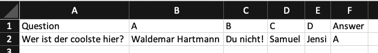

# TelegramQuiz
### Table of Contents 
  * [What does TelegramQuiz do?](#what-does-telegramquiz-do?)
  * [Setup](#setup)
  * [Run TelegramBot](#run-telegramquiz)
  * [Configure TelegramQuiz](#set-telegramquiz-questions)
  * [Try TelegramQuiz](#try-telegramquiz)

## What does TelegramQuiz do?

TelegramQuiz is a python based script, which feeds your Telegram bot with multiple-choice questions. The following commands can be performed with this bot
* /start - Diplays a multiple-choice question to the user
* /help - Displays all commands and bot interactions to the user
* /config - Displays a menu for quiz parameter adjustments (tbd)
* Any other message will be echoed to the user

## Setup

Open your shell, navigate to desired directory

```
$ cd /this/is/a/directory
```

and clone the repository.

```
$ git clone https://github.com/juliwalter/TelegramQuiz.git
```

Make sure to create a file *.env* in the same folder as *main.py* and add the following line to it whereat 'your_token_id' has to be replaced by your personal Telegram bot token.

```
TELEGRAM_TOKEN='your_token_id'
```

Create a virtual environment *venv* by typing following
```
$ python3 -m venv venv
```

activate it by 
```
$ source venv/bin/activate
```

and install the following modules.
```
$ pip install python-telegram-bot --upgrade
$ pip install python-dotenv
$ pip install pandas
```


Deactivate the virtual environment to finish the setup.
```
$ deactivate
```

## Run TelegramQuiz
Activate the virtual environment
```
$ source venv/bin/activate
```

navigate to *app* and run the *main.py* script.
```
$ cd app
$ python main.py
```

To stop the script hit *ctrl* + *c*.

## Set TelegramQuiz questions
In *'app/database/questions.csv'* one can change the desired questions within the TelegramQuiz-Bot by providing the data in the following way. <br><br> 


## Try TelegramQuiz
Try TelegramQuiz your own by scanning the following QR-Code. <br><br> 

